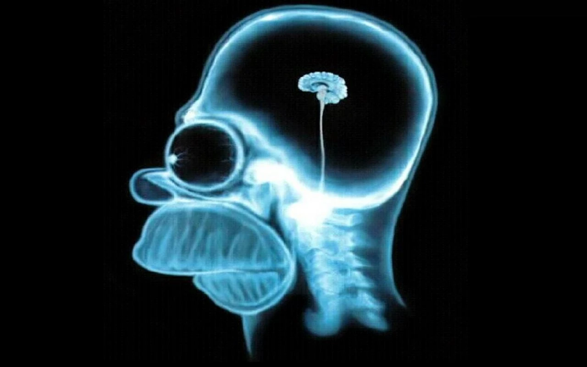

# AI Generation

How AI has changed and is changing our way of living and working


<!-- _paginate: false -->
<!-- _footer: "" -->
<!-- style: "
img[alt~='center'] {
  display: block;
  margin: 0 auto;
}
img[alt~='floatleft'] {
  float: left;
  margin: auto;
}
img[alt~='floatright'] {
  float: right;
  margin: auto;
}
h2 {
    color: #e50000;
    position: absolute;
    top: 0px;
    background-color: white;
    width: 100%;
    left: 0;
    padding: 5px 0px 0px 75px;
    height: 50px;
    border-bottom: 1px solid red;
    margin: 0px;
}
h3 {
    color: #e50000;
}
footer {
    width: 100%;
    left: 5px;
    bottom: 0;
    padding: 10px 0 0px 10px;
    background-color: white;
    height: 50px;
}
section::after {
  content: attr(data-marpit-pagination) ' / ' attr(data-marpit-pagination-total);
}
" -->

---

## How can they be smarter than us?



---

## They're not smarter, they have more data

The **importance of data** in **Artificial Intelligence (AI)** is crucial to fully understand the potential of this growing technology.

Data represents the foundation on which any AI application is based: it defines both the **quality** and **effectiveness** of the model.

An AI model trained with biased, unrepresentative, or poor-quality data will also produce poor-quality results.

Therefore, the selection and preparation of data used for training and validating AI systems is of central importance.

---

## Some fields where AI is revolutionizing the way we work


---

## Medicine

The medical field is one of the sectors where AI has the potential to have a significant impact.

The reason is that AI can analyze huge amounts of medical data much faster and more accurately than humans.

- PubMed: an online bibliographic database in the biomedical and life sciences field, developed and maintained by the National Center for Biotechnology Information (NCBI): includes over 33 million biomedical literature citations from MEDLINE, scientific journals, and online books
- CancerLinQ: oncology data collections
- Electronic Health Records (EHR)
- IoT: Data collected from sensors and wearable devices

---

## Yes, but in practice?


---

## The doctor will be guided by data, not replaced

- Reduction in administrative processes: spend less time on bureaucracy
- Virtual assistants for therapy management and patient communication: Neuralink
- Reduction in dosage errors
- Less invasive surgeries
- Fraud prevention
- More accurate and timely diagnoses

---

## The decision remains in human hands

Free AI can already be used now for diagnosis and therapy

- OpenBioLLM-70B
<https://huggingface.co/aaditya/Llama3-OpenBioLLM-70B>
Efficiently analyzes and summarizes complex clinical notes, EHR data, and discharge summaries, extracting key information and generating concise, structured summaries.
Can provide answers to a wide range of medical questions.
Can perform advanced clinical entity recognition by identifying and extracting key medical concepts, such as diseases, symptoms, medications, procedures, and anatomical structures, from unstructured clinical text.

- Med-PaLM - Google
<https://sites.research.google/med-palm/>

---

## But can I try them?

All you need is a powerful enough computer or connection to an online service: however, they **do not replace** the doctor and **do not guarantee** the accuracy of diagnoses: there's always the problem of hallucinations.

---

## How do you treat drapetomania?

According to **OpenBioLLM-70B**

There is no known cure for **drapetomania** at this time. It is considered a rare and complex mental disorder characterized by an irresistible urge to pull out one's hair.

---

## In reality

**Drapetomania** was a supposed mental disorder, described by American physician Samuel Cartwright in 1851, characterized by the desire to flee cultivated by African-American slaves.

---

## Right to hallucinate

Hallucination is still a real problem.

AI shouldn't choose for us; at the moment, the decision is still human.

We still possess free will, until trust becomes such that this too is taken from us.

---

## Vipiteno

Phantom interruption of A22 at Brennero, Vipiteno invaded: Many are leaving the highway which is actually free


<https://www.ansa.it/sito/notizie/cronaca/2024/05/30/interruzione-fantasma-della22-al-brennero-invasa-vipiteno_10ecefdd-f50d-4ac5-84a8-5d7fc4f30b87.html>

---

## The future

According to the latest World Economic Forum report: **"Jobs of Tomorrow: Large Language Models and Jobs"**, the work activities most likely to be replaced will be those with repetitive jobs:

Office workers: 81% of their work is automatable
Management analysts: 70%
Telemarketing operators: 68%
Statistical assistants: 61%
Cashiers: 60%

Jobs with high automation potential are office jobs: record keeping and information management.

---

## Which AI applications are helping people now

- **Voice recognition**: Speech understanding
- **Automatic translation**: Translates speech into other languages in real-time
- **Image recognition**: Understands image content: what's in my fridge?
- **Autonomous driving**: Take me home?
- **Facial recognition**: What mood am I in?
- **Automatic writing**: Can you correct my text?
- **Text generation**: Can you help me respond to this email?
- **Interpretation**: Can you summarize and explain this text to me?
- **RAG** (Retrieval Augmented Generation): Can you help me find information on this topic?

---

## Atlas

.png)

---

## Future

```text
Today's AIs are the worst we will see
```

---

## Sources

<https://www.healthtech360.it/salute-digitale/big-data/big-data-informazioni-vitali-per-il-sistema-sanitario/>
<https://www.ibm.com/blog/the-benefits-of-ai-in-healthcare/>
<https://www.oracle.com/it/artificial-intelligence/what-is-ai/ai-in-healthcare/>
<https://calcioanalytics.substack.com/p/lintelligenza-artificiale-nel-calcio>
<https://huggingface.co/Clinical-AI-Apollo/Medical-NER>
<https://med.stanford.edu/content/dam/sm/frontierofaicare/documents/Presenters/Baker%2C%20Adam.pdf>

---

## Who am I?

Matteo Baccan is a veteran in software engineering, boasting over three decades of experience in the development sector. Through the years, he has closely followed the historical evolution of computer science, reaching the conclusion that the secret to success lies not only in the ability to create functional products but also in the ability to embrace innovation while maintaining consistency and stability.

Beyond his professional activity, Matteo actively engages in technical dissemination. As a professor at the Academy of Fine Arts in Novara, he guides students in the world of Web Design, Digital Technologies, and Artificial Intelligence applications. Additionally, he has contributed articles to numerous specialized publications and has participated as a speaker at important national events in the field of computer science.

---

## Disclaimer

The author generated this text partly with GPT, OpenAI's large language generation model. After generating the language draft, the author reviewed, modified, and revised the language at their discretion and takes ultimate responsibility for the content of this publication.

The background image was generated with <https://app.haikei.app>
